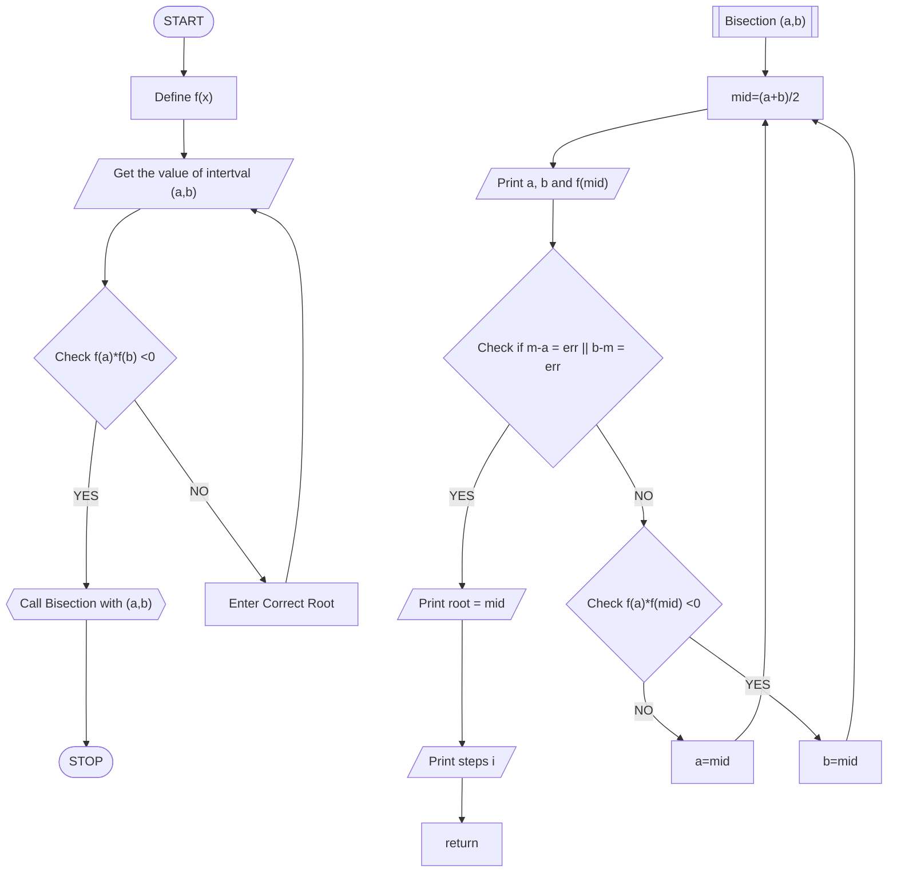

```mermaid
flowchart TD

A([START]) -->B["Define f(x)"]
B --> C[/"Get the value of intertval (a,b)"/]
C --> D{"Check f(a)*f(b) <0 "}
D --"YES"-->E{{"Call Bisection with (a,b)"}}
D --"NO"-->F[Enter Correct Root]
F --> C
E --> S([STOP])

x[["Bisection (a,b)"]]--> Q["mid=(a+b)/2"]
Q--> Z[/"Print a, b and f(mid)"/]
Z--> P{"Check if m-a = err || b-m = err"}
P--"NO"--> W{"Check f(a)*f(mid) <0"}
P--"YES"--> l[/"Print root = mid"/] --> a[/"Print steps i"/]--> d[return]
W--"NO"-->c["a=mid"]-->Q
W--"YES"-->i["b=mid"]-->Q
```
