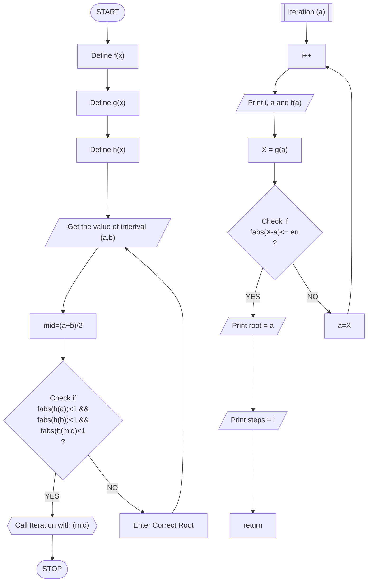

# Iteration Flowchart

```mermaid
flowchart TD

A([START]) -->B["Define f(x)"] 
B-->z["Define g(x)"]
z-->L["Define h(x)"]
L --> C[/"Get the value of intertval (a,b)"/]
C-->D["mid=(a+b)/2"]
D-->y{"Check if<br/> fabs(h(a))<1 &&<br/> fabs(h(b))<1 && <br/>fabs(h(mid)<1<br/>?"}
y--"YES"-->E{{"Call Iteration with (mid)"}}
y--"NO"-->F[Enter Correct Root]-->C
E --> S([STOP]) 

x[["Iteration (a)"]]--> Q["i++"]--> c[/"Print i, a and f(a)"/] 
c--> Z["X = g(a)"]
Z-->P{"Check if<br/>fabs(X-a)<= err<br/>?"}
P--"YES"--> l[/"Print root = a"/] --> a[/"Print steps = i"/]--> d[return]
P--"NO"-->W["a=X"]--> Q
```
