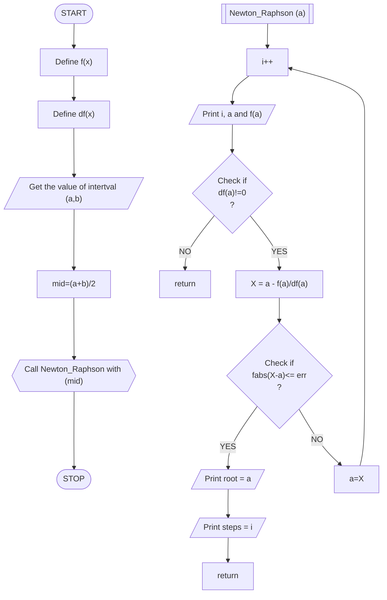

# Newton Raphson Flowchart

```mermaid
flowchart TD

A([START]) -->B["Define f(x)"] 
B-->L["Define df(x)"]
L --> C[/"Get the value of intertval (a,b)"/]
C-->D["mid=(a+b)/2"]
D -->E{{"Call Newton_Raphson with (mid)"}}
E --> S([STOP]) 

x[["Newton_Raphson (a)"]]--> Q["i++"]--> c[/"Print i, a and f(a)"/] 
c--> Z{"Check if <br/> df(a)!=0 <br/> ?"}
Z--"NO"--> e[return]
Z--"YES"--> q["X = a - f(a)/df(a)"]
q-->P{"Check if<br/>fabs(X-a)<= err<br/>?"}
P--"YES"--> l[/"Print root = a"/] --> a[/"Print steps = i"/]--> d[return]
P--"NO"-->W["a=X"]--> Q
```
