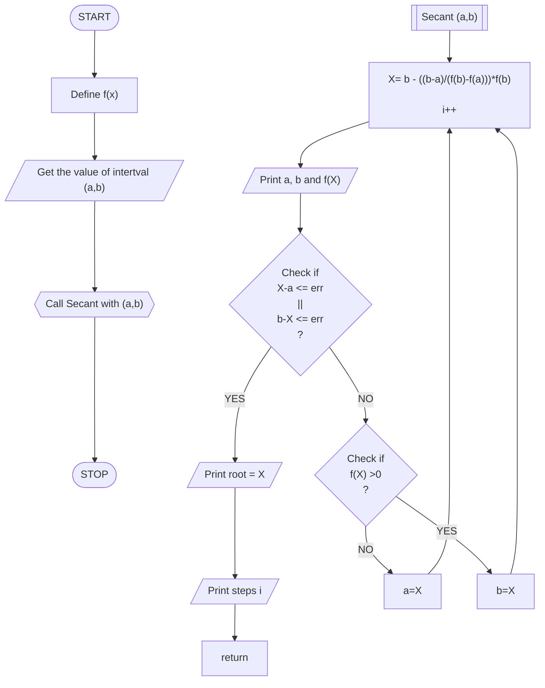

# Secant Flowchart

```mermaid
flowchart TD

A([START]) -->B["Define f(x)"]
B --> C[/"Get the value of intertval (a,b)"/]
C -->E{{"Call Secant with (a,b)"}}
E --> S([STOP])

x[["Secant (a,b)"]]--> Q["X= b - ((b-a)/(f(b)-f(a)))*f(b) <br/><br/> i++"]
Q--> Z[/"Print a, b and f(X)"/]
Z--> P{"Check if <br/> X-a <= err <br/> || <br/> b-X <= err <br/> ?"}
P--"NO"--> W{"Check if  <br/>f(X) >0 <br/> ?"}
P--"YES"--> l[/"Print root = X"/] --> a[/"Print steps i"/]--> d[return]
W--"NO"-->c["a=X"]-->Q
W--"YES"-->i["b=X"]-->Q
```
